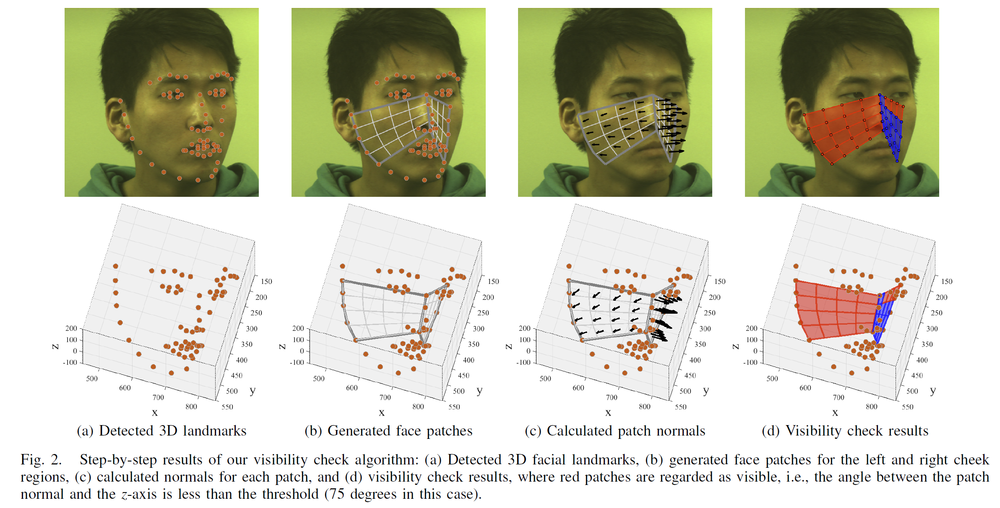
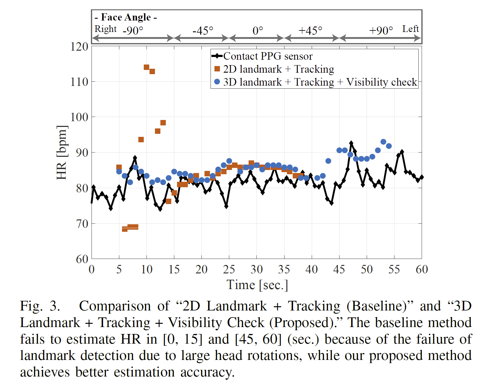

# Remote Heart Rate Estimation Based on 3D Facial Landmarks
We provide the code for "Remote Heart Rate Estimation Based on 3D Facial Landmarks" presented in EMBC2020.

## Overview
This code estimates a person's heart rate (HR) based on 3D facial landmarks. We propose a novel face patch visibility check manner based on the face patch normal in the 3D space. We only use visible patches for BVP estimation. The following figure is the step-by-step explanation of our visibility check.

 

## Quick start using our sample data

1. Download our repository  
 ` git close https://github.com/ymonno/3DfaceHR.git /path/to/direc `  
2. Run the following Matlab commands to download our sample data.</a>  
` cd  /path/to/direc `  
` setupHRestimation() ` 
3. Run demo.m

*In our method, we used <a href="https://github.com/1adrianb/face-alignment" target="_blank">'the face alignment method presented in ICCV2017'</a></b> for 3D facial landmark detection. We proovide the deected 3D facial landmarks for our sample data.

## Main Functions

### __- demo.m__
You can instantly run our whole code to our sample data and display a comparison between sequential HR of baseline method, proposed method, and reference contact PPG sensor visually as shown in Fig.3. Estimated HR at a certain time window is stored in the corresponding matfile.

 

### __-getSignals\_*.m__
Estimate blood volume pulse (BVP) using our proposed method or compared methods. 
#### getSignals_3DLand_Tracking_VisibilityCheck.m 
angleThres = 75 [degrees] 
-> Estimate BVP with the proposed method. [3D Landmark + Tracking + Visibility check]  
angleThres = Inf [degrees] 
-> Estimate BVP with the compared  method. [3D Landmark + Tracking]  
#### getSignals_2DLand_Tracking_withOut_VisibilityCheck.m
angleThres = Inf [degrees] 
-> Estimate BVP with the baseline method. [2D Landmark + Tracking]  
#### getSignals_2DLand_fixed1stFrame.m
angleThres = Inf [degrees] 
-> Estimate BVP with the compared  method. [2D Landmark]

#### Input 
- videoFileName: Full path or relative path to the video.
- startTime/endTime: BVP is estimated using the video within the time window [startTim eendTime].
- angleThres: An threshold of angle used in Fig.2(d) visibility check. In this paper, we use 75 [degrees] for proposed method.

#### Output
- bvpSignal: Estimated BVP signal.
- frameRate: Framerate of the movie.
- time: Time-stamp of the BVP.
- cheekGridReliability: Logical matrix which represent whether facial patch is reliable(1) or not(0).

### __- run_getSignals\_*.m__
Run respective code which gets BVP signals for a movie with sliding window. The estimated BVP is stored in .mat file.

#### Input
- folder: Relative or absolute path to the movie folder. We assume the name of the video is 'video.avi'.
- movingWindowWidth: Width of moving window for the BVP estimation. We use 10 sec in the paper.
- frameRate: Framerate of the input video.
- angleThres: Threshold of the angle between the camera plane and the facial patch. We use 75 [degrees] for our proposed method.
- movie2Use: Define which part of movie to use. If you want to use 5 sec. to 45 sec. of the movie, `movie2Use = [5 45]`. 

### __- gridCheekAreaOverlap.m__
This function grid chhek area into facial patch as shown in Fig.2 (b). Each patch is represented by 4 vertices.
### Input
- Landmarks: Detected 3D facial landmarks.
- overLapRatio: Define how patches are overlaped each other. If overLapRatio = 0, patchese are not overlap. If overLapRatio = 0.4, 40% of the patch edge is overlaped. In this paper we set overLapRatio = 0.
- gridLengthRatio: Define the size of each facial patch. If you want to grid cheek region into 4-by-4 patches just like Fig.2 (b), you should set gridLengthRatio = 0.25, overLapRatio = 0.

### Output
- GridVertices: GridVertices contains vertices of each facial patch. Each cell component corresponds to the facial patch. GridVertices{m,n} = [x_1, y_1, z_1; x_2, y_2, z_2; x_3, y_3, z_3; x_4, y_4, z_4]

### __- interDiv3d.m__
This function inter devide the edge of cheek region (Gray bold edge in Fig.2(b)) based on 3D space distance.
#### Input 
- edgePts: 3D edge points. edgePts(m,:) represente 3d point [x, y, z].
- overLapRatio/gridLengthRatio: Same as __gridCheekAreaOverlap.m__.

#### Output
- beginIdx/endIdx: edgePts(beginIdx,:) = [x, y, z] which is begin point of the facial patch.

### __-  GetNormal.m__
#### Input
- Prand: Prand corresponds to GridVertices{m,n}.

#### Output
- Nvec: Normal vector of the facial patch as shown black vector in Fig.2(c). Nvec = [Nvec_x, Nvec_y, Nvec_z]

### __- main.m__
You can run our proposed method and baseline methods. We assume that input is set of images at a certain folder. Estimated HR at a certain time window is stored in the corresponding matfile.
#### setup
You have to finish some preparations before run main.m. 
1. Install [Anaconda](https://www.anaconda.com/).

2. Install face-alignment using conda  
    Run following comands on the anaconda. 
    ` conda create face_alignment ` 
    ` conda activate face_alignment`
    ` conda install -c 1adrianb face_alignment ` 
3. Run face-alignment.
    1. Edit ./run_face_alignment.py, 20th raw of /path/to/imgages/
    2. Move ./run_face_alignment.py to acaconda working directory.
    3. Run ` run_face_alignment.py ` on the conda comand line.
4. [OPTIONAL] To use our data, run ` setupHRestimationForMain() ` on the Matlab.
#### Input
- movie2Use: Define which part of movie to use. If you want to use 5 sec. to 45 sec. of the movie the `movie2Use = [5 45]`. 
- path_to_images: Path to the folder which contains images.
- frameRate: Framerate of the movie. 
